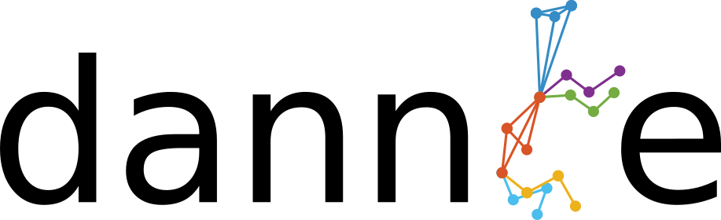
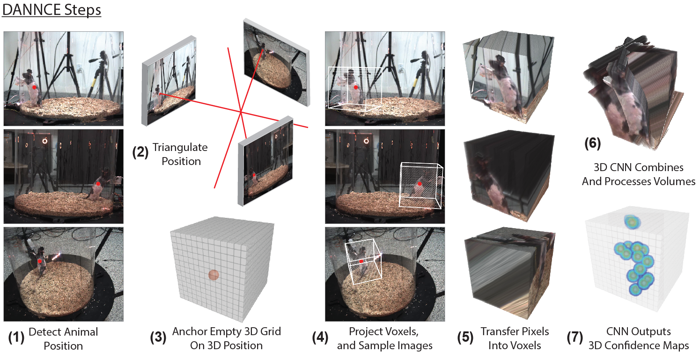
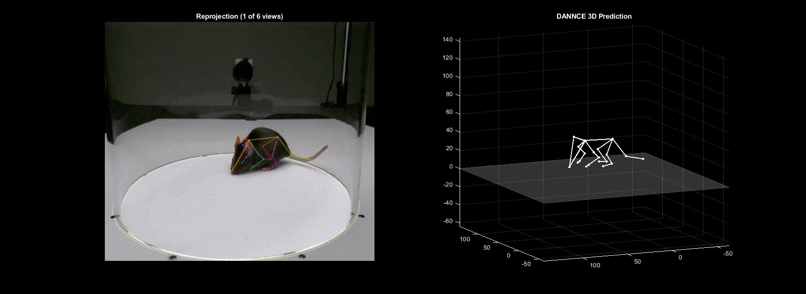
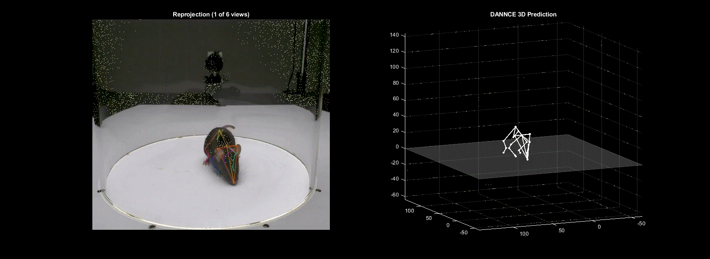
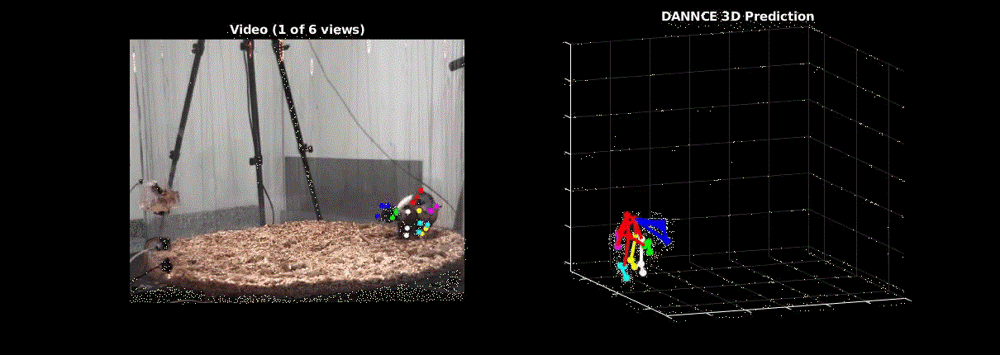

Repository Contributors: Timothy Dunn, Jesse Marshall, Diego Aldarondo, William Wang, Kyle Severson 

DANNCE (3-Dimensional Aligned Neural Network for Computational Ethology) is a convolutional neural network (CNN) that extracts the 3D positions of user-defined anatomical keypoints from videos of behaving animals. The key innovations of DANNCE compared to existing approaches for 2D keypoint detection in animals (e.g. LEAP, DeepLabCut) are that (1) the network is fully 3D, so that it can learn more abstract 3D features about how cameras and keypoints relate to one another and (2) we pre-train DANNCE using a large dataset of rat motion capture and synchronized video, so that the network learns what rodents look like ahead of time. The network's ability to track keypoints transfers well to mice and other mammals, and works across different camera views, camera types, and illumination conditions. To use DANNCE, first you must collect video recordings of animals from at least two views using synchronized, calibrated cameras. Calibrating cameras is a straightforward procedure, with toolboxes available in Matlab and Python, and we include our calibration scripts below. After acquisition, one can use DANNCE to detect keypoints. The DANNCE algorithm is currently configured as a two-stage system. First, videos are processed to extract the overall position of the animal in each video frame. Then, these positions are used to create *unprojected* 3D image volumes for each view that contain the animal. These image volumes are used as input to the CNN to make keypoint predictions.

## Examples

#### Mouse

#### Mouse (slowmo)

#### Rat

## Camera Calibration
To use DANNCE, acquisition cameras must be synchronized, calibrated, and ideally compressed. Synchronization is best done with a frametime trigger and a supplementary readout of frame times. Calibration is the process of determining the distortion introduced into an image from the camera lens (Camera Intrinsics), and the relative position and orientation of cameras to one another in space (Camera Extrinsics). We calibrate cameras in a two-step process, where first we use a checkerboard to find the camera intrinsics, and then an 'L-frame' to determine the camera extrinsics. The L-frame is a calibrated grid of four or more points that are labeled in each camera. A checkerboard can also be used for both procedures. We have included two examples of calibration in Matlab (in `Calibration/`), one that is a long script, and a second that performs the steps independently. 

Some tips:
1) Try to sample the whole volume of the arena with the checkerboard to fully map the distortion of the lenses.
2) If you are using a confined arena (eg a plexiglass cylinder) that is hard to wand, it often works to compute the calibration without the cylinder present.
3) More complicated L-Frames can be used, and can help, for computing the extrinsics. Sometimes using only a four point co-planar L-frame can result in a 'flipped' camera, so be sure to check camera poses after calibration. 

It is often helpful to compress videos as they are acquired to reduce diskspace needed for streaming long recordings from multiple cameras. This can be done using ffmpeg or x264, and we have included two example scripts in `Compression/`. One, `campy.py`, was written by Kyle Severson and runs ffmpeg compression on a GPU for streaming multiple Basler cameras. A second, CameraCapture was originally written by Raj Poddar and uses x264 on the CPU to stream older Point Grey/FLIR cameras (eg Grasshopper, Flea3). We have included both a compiled version of the program and the original F-Sharp code that can be edited in Visual Studio. 

Mirrors. Mirrors are a handy way to create new views, but there are some important details when using them with DANNCE. The easiest way to get it all to work with the dannce pipeline is to create multiple videos from the video with mirrors, with all but one sub-field of view (FOV) blacked out in each video. This plays well with the center-of-mass finding network, which currently expects to find only one animal in a given frame.

When calibrating the mirror setup, we have used one intrinsic parameter calibration over the entire FOV of the camera, typically by moving the experimental setup away from the camera (moving the camera could cause changes in the intrinsics). We used these intrinsic parameters for all sub-FOVs. We also used the one set of distortion parameters to undistort the entire FOV. After you have these the parameters, you take images of the calibration target with the mirrors in place and calibrate the extrinsics for each sub-FOV independently and go from there.

Cameras tested:
1) Point Grey Flea3
2) Blackfly  BFS-U3-162M/C-CS
3)  Basler Aca1920-155uc, Aca640-750um, Aca720-510um

## DANNCE Installation

The following combinations of operating systems, python, tensorflow, cuda, and cudnn distributions have been used for development.

|      OS      | python | tensorflow | cuda | cudnn | pytorch |
|:------------:|:------:|:----------:|:----:|:-----:|:-------:|
| Ubuntu 16.04 |  3.7.x |   2.2.0   |  10.1 |  7.6  |  1.5.0  |
|  Windows 10  |  3.7.x |   2.2.0   |  10.1 |  7.6  |  1.5.0  |

`DANNCE` requires a CUDA-enabled GPU and appropriate drivers. We have tested DANNCE on NVIDIA Titan V, Titan X Pascal, Titan RTX, and V100. On an NVIDIA Titan V, DANNCE can make predictions at ~10.5 samples per second when using 6 cameras. DANNCE is also embarrassingly parallel over multiple GPUs. 

We recommend installing `DANNCE` in the following steps:

1. Set up a new conda environment with the following configuration: `conda create -n dannce python=3.7 cudatoolkit=10.1 cudnn`

2. Activate the new conda environment: `conda activate dannce`

3. Install dannce with the included setup script by running `python setup.py install` within the base dannce repo folder.

You should be good to go! These installation steps were tested with conda version 4.7.12, although we expect it to work for most conda installations.

**A note on the pytorch requirment**
Pytorch is not required, but 3D volume generation is significantly faster when using pytorch than with tensorflow or numpy. To use tensorflow only, without having to install the pytorch package, simply toggle the `predict_mode` field in the DANNCE configuration files to `tf`. To use numpy volume generation (slowest), change `predict_mode` to `None`.

## Demo Quickstart
To test your DANNCE installation and familiarize yourself with DANNCE file and configuration formatting, run DANNCE predictions over `markerless_mouse_1`. Because the videos and network weights files are too large to host on GitHub, use the links in `demo/markerless_mouse_1/DANNCE/train_results/link_to_weights.txt`, `demo/markerless_mouse_1/DANNCE/AVG/train_results/link_to_weights.txt`, `demo/markerless_mouse_1/videos/link_to_videos.txt` to download necessary files and place them in each associated location.

Alternatively, on Linux you can run the following commands from the base dannce directory:

For markerless_mouse_1:

`wget -O vids.zip https://www.dropbox.com/sh/wn1x8erb5k3n9vr/AADE_Ca-2farKhd38ZvsNi84a?dl=1 ; unzip vids.zip -d vids ; mv vids/* demo/markerless_mouse_1/videos/ ; rm -r vids vids.zip ; wget -O demo/markerless_mouse_1/DANNCE/train_results/AVG/weights.1200-12.77642.hdf5 https://www.dropbox.com/s/4b97fg5ciznllnt/weights.1200-12.77642.hdf5?dl=1 ; wget -O demo/markerless_mouse_1/DANNCE/train_results/weights.12000-0.00014.hdf5 https://www.dropbox.com/s/wnjlfhylaxtecax/weights.12000-0.00014.hdf5?dl=1`

For markerless_mouse_2:

`wget -O vids2.zip https://www.dropbox.com/sh/tspmwo36gbj6b4x/AAA_sWJA6K1ksX8f6hBoZf7Ia?dl=1; unzip vids2.zip -d vids2 ; mv vids2/* demo/markerless_mouse_2/videos/ ; rm -r vids2 vids2.zip` 

Once the files are downloaded and in their correct places, run:

`cd demo/markerless_mouse_1`

`python ../../predict_DANNCE.py config.yaml`

This demo will run the `AVG` version of DANNCE over 1000 frames of mouse data and save the results to `demo/markerless_mouse_1/DANNCE/predict_results/save_data_AVG.mat`.

The `AVG` version of DANNCE generally produces smoother and more precise 3D tracking because it converts the final 3D probability map for each landmark into a continuous 3D coordinate by taking the spatial average over this volume. However, the `AVG` network can sometimes be tricky to fine-tune. If you are having trouble getting the `AVG` network to converge to a satisfactory error level, consider trying the `MAX` version of the nerwork, which assigns each landmark the 3D coordinate of the voxel containing the maximum value over the final 3D probability map.  

## Formatting The Data
DANNCE requires a set of videos across multiple views and a `*dannce.mat` file that contains camera calibration parameters, a structure that synchronizes frames across views, and in the case of training, the 3D labels. 

We recommend setting up individual project folders for each video recording session, as in the dannce demos (`./demo`), although the dannce configuration files are flexible enough to support more custom file and directory organizations. The demo project folders also contain examples of all of the following formatting information.

**video directories**.
DANNCE requires a parent video directory with *n* sub-directories, one for each of *n* cameras. Within each subdirectory, videos must be named according the frame index of the first frame in the file. For example, for a three-camera system, the video directory must look like:

./videos/

+-- Camera1

|\_\_+--0.mp4

+-- Camera2

|\_\_+--0.mp4

+-- Camera3

|\_\_+--0.mp4

DANNCE can also accommodate an additional level of subdirectories if `vid_dir_flag` is set to `False` in the main configuration files.

./videos/

+-- Camera1

|\_\_+--3503723726252562

|\_\_\_\_\_+--0.mp4

+-- Camera2

|\_\_+--3503723999451111

|\_\_\_\_\_+--0.mp4

+-- Camera3

|\_\_+--3503723711118999

|\_\_\_\_\_+--0.mp4

**configuration files**

`DANNCE` uses two configuration files and one data file. 

- *main config*, e.g. `configs/*.yaml`. This file defines data and model hyperparameters. It can be reused across experiments.  
- *io config*, e.g. `demo/markerless_mouse_1/io.yaml`. This file defines input data and ouput directories. It is used for a single experiment. 
- *dannce.mat*, e.g. `demo/markerless_mouse_1/label3d_dannce.mat`. This file contains three cell arrays of matlab structures. `params` stores the camera parameters for each camera. `sync` stores a vector that synchronizes all cameras. `labelData` stores the frame identities and 3d labels for hand-labeled frames. This file can be produced automatically with `Label3D.exportDannce()`.

**camera calibration parameters**.
Dannce requires structs for each camera containing the camera's rotation matrix, translation vector, intrinsic matrix, radial distortion, and tangential distortion. If you use our included calibration scripts, you can convert the output to the required format with `utils/convert_calibration.m`. 

A properly formatted calibration struct has the following fields, `['R','t','K','RDistort','TDistort']`. 

**synchronization files**.
DANNCE requires a set of sync structs, one for each camera, which define frame synchrony across the different cameras over time. If you know your cameras are reliably synchronized at all times (e.g. via hardware triggering), these files can be generated with the aid of `dannce/utils/makeSyncFiles.py`. Once your video directories are set up correctly, sync files can get generated by running `python dannce/utils/makeSyncFiles.py {path_to_videos} {acquisition_frame_rate} {number_tracked_landmarks}`, where {.} denotes variables you must replace with relevant values. See the `makeSyncFiles.py` docstring for more information.

If your cameras are not natively synchronized, but you can collect timestaps for each frame, sync files should be generated by `dannce/utils/preprocess_data.m`, which will generate sync files from a properly formatted `.mat` file listing the frameID for each camera at each timepoint. See `/dannce/utils/example_matchedframs.mat` file for how these timestamp data should be formatted before running `preprocess_data.m`.

## Hand-Labeling
For fine-tuning DANNCE to work with your animal and system, we developed a labeling GUI, which can be found in a separate repo: https://github.com/diegoaldarondo/Label3D. The `Label3D` repository should be cloned with DANNCE automatically as a submodule when using `git clone --recursive https://github.com/spoonsso/dannce` When labeling is completed, the labels can be used to train DANNCE and the COMfinder network (see below) after converting the Label3D files to DANNCE format using `Label3D.exportDannce()`.

## Training and Predicting with the COMfinder U-Net
DANNCE requires a reasonable estimate of the 3D position of the animal in each frame. We obtain this by triangulating the 2D center of mass (COM) of the animal in each frame. You can use your favorite method to find an estimate of the animal COM in each frame, but we trained a 2D U-Net to do it. Our U-Net is brittle and typically requires some additional training data to get it working on new views, new environments, and new species. If working with hand-labeled data, your same data structures can be used to train both the COMfinder network and the DANNCE network.

Given formatted data, a properly organized directory structure, and a config file (see demo folder), navigate to your project folder and run

`python $my_path_to_DANNCE/train_COMfinder.py ./config.yaml`, where `$my_path_to_DANNCE` is a path to the root DANNCE directory.

After training, run `python $my_path_to_DANNCE/predict_COMfinder.py ./config.yaml`. To generate center of mass predictions.

## Training and Predicting with DANNCE

Once the COM is found, the main DANNCE network can be trained by running:

`dannce-train /path/to/main_config.yaml`

After training, run

`dannce-predict /path/to/main_config.yaml` from within an experiment folder to make 3D predictions using the trained model.

Consult the demo folder for directory and config file formatting examples

